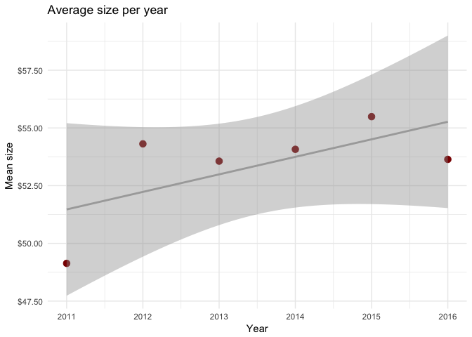

Kaggle-Russian Housing: Importing data and analysing year
================
Maria
May 19, 2017

Libraries
---------

``` r
library(data.table)
library(tidyverse) #ggplot %>%
library(lubridate)
library(scales) #scale dollar on ggplot
library(corrplot) #corrplot
#library(DT)
```

Importing data
--------------

``` r
dtrain <- read.csv('/Applications/R/Russian Bank/train.csv', stringsAsFactors=TRUE)
dtest <- read.csv('/Applications/R/Russian Bank/test.csv', stringsAsFactors=TRUE)
dmacro <- read.csv('/Applications/R/Russian Bank/macro.csv', stringsAsFactors=TRUE)
```

Combining train and test for analysis
-------------------------------------

Creating variable `price_doc` to combine datasets

``` r
dtest$price_doc<-NA
```

Creating `test` indicator

``` r
dtest$test<-1
dtrain$test<-0
```

Combining data sets

``` r
dtotal<-rbind(dtrain,dtest)
```

Date variable
-------------

Changing format

``` r
dtotal$timestamp<-as.Date(dtotal$timestamp)
```

Creating variables year and month

``` r
dtotal$year<-year(dtotal$timestamp)
dtotal$month<-month(dtotal$timestamp)
```

Year analysis
-------------

Year distribution

``` r
ggplot(data=dtotal,aes(x=year,fill=as.factor(test)))+
  geom_bar()+
  scale_fill_hue(l=40, c=35)+
  labs(x="Year",y="Count",title="Year distribution")+
  theme_minimal()
```

 We can see that the test dataset only contain years 2015 and 2016

### Box plot

``` r
ggplot(data=dtotal,aes(x=year,y=price_doc,group=as.factor(year)))+
  geom_boxplot(color="darkred")+
  scale_y_continuous(labels = dollar)+
  labs(x="Year",y="Price",title="Box Plot: Price per Year")+
  theme_minimal()
```


### Is price increasing with years?

``` r
dtotal[!is.na(dtotal$price_doc),] %>% 
  group_by(year) %>% 
  summarize(mean_build_price=mean(price_doc)) %>%
  ggplot(aes(x=year, y=mean_build_price))+
  geom_point(color="darkred",size=3)+
  geom_smooth(method="lm",color='darkgrey')+
  scale_y_continuous(labels = dollar)+
  labs(x="Year",y="Mean Price",title="Price per Year relationship")+
  theme_minimal()
```


There is obliviously an increase on price with years

### Is price seasonal?

``` r
dtotal[!is.na(dtotal$price_doc),] %>% 
  group_by(year,month) %>% 
  summarize(mean_build_price=mean(price_doc)) %>%
  ggplot(aes(x=month, y=mean_build_price))+
  geom_line(color="darkred")+
  facet_grid(year~.)+
  labs(x="Month",y="Mean Price",title="Price per month relationship")+
  scale_x_continuous(breaks=c(1:12))+
  scale_y_continuous(labels = dollar)+
  theme_minimal()
```


### Are housings getting bigger?

``` r
dtotal %>% 
  group_by(year) %>% 
  summarize(mean_full_sq=mean(full_sq)) %>%
  ggplot(aes(x=year, y=mean_full_sq))+
  geom_point(color="darkred",size=3)+
  geom_smooth(method="lm",color='darkgrey')+
  scale_y_continuous(labels = dollar)+
  labs(x="Year",y="Mean size",title="Average size per year")+
  theme_minimal()
```


It seems so..

### Type of product per year

``` r
ggplot(data=dtotal,aes(x=year,fill=product_type))+
  geom_bar(position = "dodge")+
  scale_fill_hue(l=40, c=35)+
  labs(x="Year",y="Count",title="Type of product per year")+
  theme_minimal()
```


